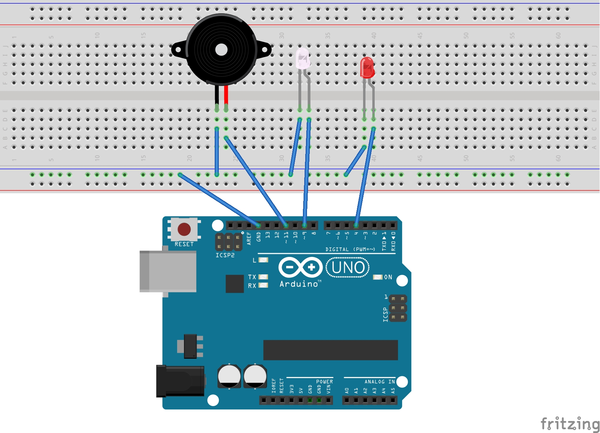

# La Zenaida in Arduino

La Zenaida is a Colombian song by Armando Hernández. This code will play
the song in your Arduino, just set up the piezo and LEDs as shown in the
image:

Send the code in `zenaida_leds.ino` to your Arduino using the Arduino IDE
and enjoy the song!
